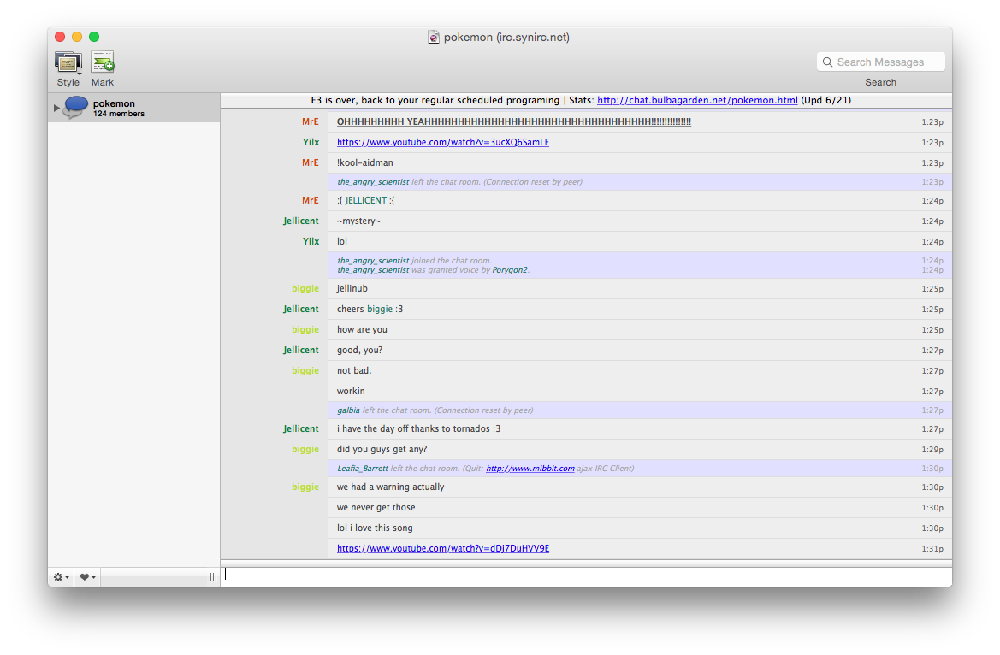
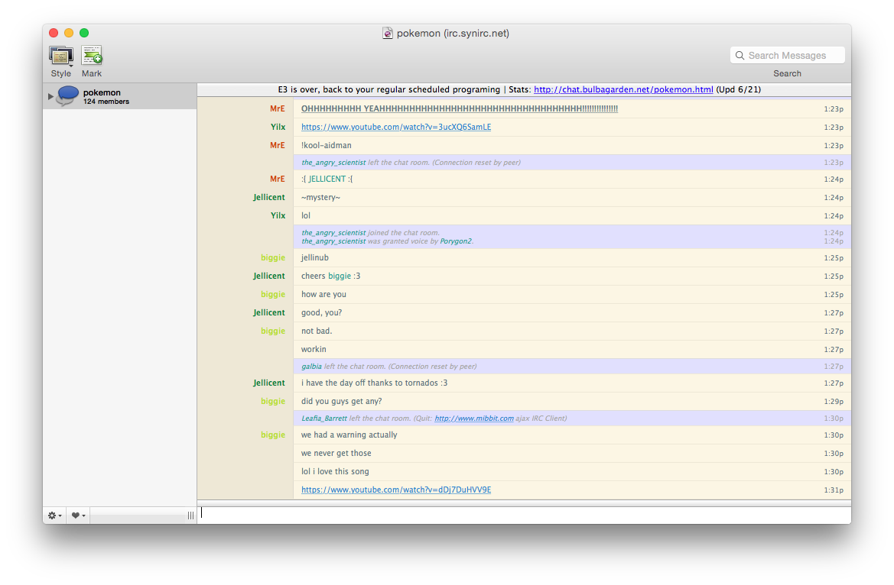
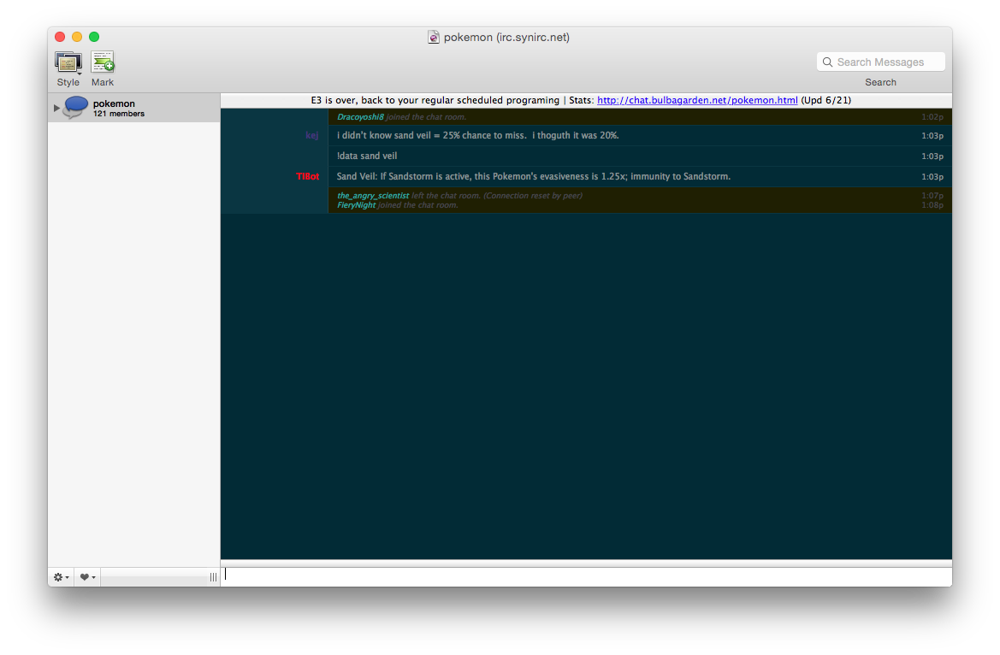

Three reasons to love Succinct
-------------------------------

1. Simple, clean design.
2. Emphasizes what you need.
3. De-emphasizes what you don’t.

Changed the original Succinct theme with some color tweaks of my own, reducing contrast. Also
added two variants, Solarized and Solarized Dark, based on http://ethanschoonover.com/solarized.
Unique nickname coloring comes courtesy of [willasaywhat](https://github.com/willasaywhat).

Default:



Solarized:



Solarized Dark:



Note: Because of the plethora of colors possible for nicknames, some may not look right
on some of the themes. It's a work in progress, I'm still going through and changing them
to fit each one just right.

Download & Install Instructions:
--------------------------------

If you're finding this theme by google and don't really know what you're doing, you're
exactly like me when I found the original. Steps to download:

1. [Download this file](https://github.com/TempSpas/succinct-for-colloquy/archive/master.zip) and unzip it.
2. Move all the contents of the folder except "Succinct.colloquyStyle" to the trash. You don't
need them. 
3. Open an additional Finder window and, from the Finder's "Go" menu, select
   "Go to Folder..." . In the dialog pane that appears, enter:
     ```/Library/Application Support/Colloquy/Styles``` (If this fails, type ```/Library/Application Support``` and
     create a folder called "Colloquy". Inside, that create one called "Styles").
4. Drag "Succinct.colloquyStyle" there.
5. Type ```/reload styles``` into Colloquy. (If this fails, restart Colloquy).

Variants of Succinct will now be a selectable theme in the Styles dropdown menu.

Editing Instructions:
---------------------

Again, when I found the original theme, I wanted to change a lot of the colors and appearance myself,
beyond what Colloquy allows you to do in the preferences menu. Here are instructions to tweak
the themes to your liking if you've already download them.

1. Locate the file. (Open a Finder window and, from the "Go" menu, select "Go to Folder..."
and enter: ```/Library/Application Support/Colloquy/Styles```
2. Right click "Succinct.colloquyStyle" and select "Show Package Contents."
3. Navigate to Contents -> Resources.
4. To change colors in the default theme, edit Main.css. To change Solarized colors, double click
the folder labeled "Variants."
5. The CSS files inside this folder are clearly labeled and ready to edit.

I used [this website](http://www.w3schools.com/tags/ref_colorpicker.asp) to pick colors, very helptful.

----------------

Contributors
------------

* Claudio Perez Gamayo <http://80kv.com>: Created first-draft design based on 37
  Signal's Campfire web application.
* Joel Watson <https://github.com/watsonian>
* Willa Riggins <https://github.com/willasaywhat>

Additional bugfixes, usability improvements, and design comments are welcome!
Just use GitHub to fork and make pull requests.

Original: <https://github.com/JohnAlbin/succinct-for-colloquy>